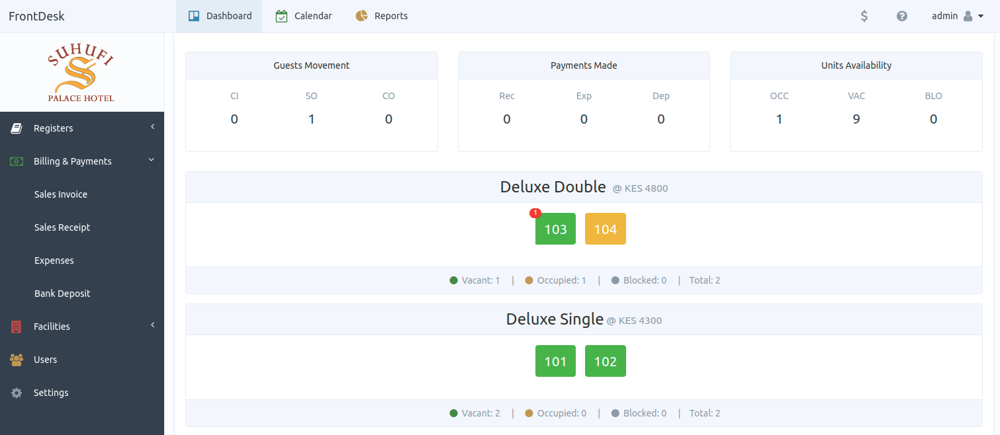

<div align="center">


# 🏨 FrontDesk PMS

### Plataforma de gestión hotelera y administración de propiedades 🚀

<p align="center">
  <b>FrontDesk PMS</b> es un sistema avanzado de administración de propiedades (PMS) diseñado para hoteles, alojamientos y servicios de renta, permitiendo gestionar habitaciones, reservas, usuarios y operaciones administrativas desde una plataforma moderna y centralizada.
</p>

<p align="center">
  
  
  
  
</p>

<p align="center">
  <a href="#-acerca-del-proyecto">Acerca</a> •
  <a href="#-módulos-del-sistema">Módulos</a> •
  <a href="#-características">Características</a> •
  <a href="#-tecnologías-utilizadas">Tecnologías</a> •
  <a href="#-vista-previa">Vista previa</a>
</p>

</div>

---

# 🌌 Acerca del proyecto

**FrontDesk PMS** es un sistema profesional de administración de propiedades diseñado para hoteles, hostales, alojamientos y servicios de alquiler, facilitando la automatización de reservas, administración de habitaciones y control operativo desde una interfaz moderna.

La plataforma fue desarrollada para:

- 🏨 Gestionar propiedades
- 🛏️ Administrar habitaciones
- 📅 Controlar reservas
- 👥 Gestionar usuarios
- 💳 Supervisar pagos
- 📊 Administrar operaciones
- 🔐 Gestionar accesos
- 🌐 Optimizar servicios de alojamiento

---

# ✨ Características

## 🏨 Gestión de propiedades

- 🏢 Registro de instalaciones
- 🛏️ Gestión de habitaciones
- 📍 Administración de ubicaciones
- 📋 Configuración de tarifas
- ⚙️ Gestión de servicios

---

## 👥 Gestión de usuarios

- 👤 Registro de clientes
- 🔐 Inicio de sesión
- 📄 Gestión de perfiles
- ⚡ Administración centralizada
- 📊 Control de accesos

---

## 📅 Sistema de reservas

- 📆 Reservas de habitaciones
- 💳 Gestión de pagos
- 📋 Historial de reservas
- ⚡ Confirmaciones rápidas
- 🛎️ Administración hotelera

---

## 📊 Panel administrativo

- 📈 Dashboard administrativo
- 🏨 Gestión de propiedades
- 👥 Administración de usuarios
- 📅 Supervisión de reservas
- 🔐 Gestión de permisos

---

# 👨‍💼 Módulos del sistema

## 🏨 Property Module

Este módulo administra todas las propiedades y alojamientos registrados dentro del sistema.

### Funcionalidades:

- ➕ Registro de propiedades
- 🛏️ Administración de habitaciones
- 📋 Configuración de tarifas
- ⚙️ Gestión de servicios
- 📍 Administración de instalaciones

---

## 👤 Customer Module

Este módulo es utilizado por clientes y huéspedes.

### Funcionalidades:

- 🔐 Inicio de sesión
- 📅 Reservar habitaciones
- 💳 Gestión de pagos
- 📄 Consultar historial
- 🛎️ Solicitar servicios

---

## 🛠️ Admin Module

Este módulo funciona como administrador principal del sistema.

### Funcionalidades:

- 👥 Gestión de usuarios
- 🏨 Supervisión de propiedades
- 📊 Dashboard administrativo
- 📅 Administración de reservas
- 🔐 Gestión general

---

# 🛠️ Tecnologías utilizadas

## 🎨 Frontend

<p>
  
</p>

- HTML5
- CSS3
- Bootstrap 3
- JavaScript
- jQuery 3.4.1
- SBAdmin2 Template

---

## ⚙️ Backend

<p>
  
</p>

- PHP 7.3
- FuelPHP 1.8.2
- Arquitectura MVC
- Gestión de sesiones

---

## 🗄️ Base de datos

<p>
  
</p>

- MySQL 5.7
- Relaciones SQL
- Persistencia de datos
- Gestión hotelera

---

## 🧰 Herramientas

<p>
  
</p>

- Git
- GitHub
- Visual Studio Code
- Composer
- Nginx

---

# 📂 Estructura del proyecto

```bash
PlataformaGestionHotelera/
│
├── fuel/                     # Núcleo FuelPHP
├── public/                   # Recursos públicos
├── fuel/app/                 # Configuración y lógica
├── fuel/packages/            # Paquetes adicionales
├── public/images/            # Recursos gráficos
├── public/assets/            # Recursos frontend
├── migrations/               # Migraciones SQL
├── nginx.conf                # Configuración Nginx
├── composer.json             # Dependencias PHP
├── README.md
└── LICENSE
```

---

# ⚡ Instalación

## 📋 Requisitos

- PHP 7.3+
- MySQL 5.7
- Composer
- Nginx
- Navegador moderno

---

# 🚀 Configuración del proyecto

## 1️⃣ Clonar repositorio

```bash
git clone https://github.com/isairey/PlataformaGestionHotelera.git
```

---

## 2️⃣ Acceder al proyecto

```bash
cd PlataformaGestionHotelera
```

---

## 3️⃣ Instalar dependencias

```bash
composer install
```

---

## 4️⃣ Ejecutar instalación

```bash
php oil refine install
```

---

## 5️⃣ Configurar base de datos

Editar:

```bash
fuel/app/config/db.php
```

Agregar:

```php
'connection' => array(
    'hostname' => 'localhost',
    'database' => 'frontdesk',
    'username' => 'root',
    'password' => '',
),
```

---

## 6️⃣ Ejecutar migraciones

```bash
php oil refine migrate --packages=auth

php oil refine migrate:current

php oil refine migrate
```

---

## 7️⃣ Ejecutar proyecto

Abrir:

```bash
http://localhost/PlataformaGestionHotelera/
```

---

# 📊 Funcionalidades principales

## 🏨 Gestión hotelera

- Administración de habitaciones
- Gestión de tarifas
- Configuración de servicios
- Control de disponibilidad

---

## 👥 Administración de usuarios

- Registro y autenticación
- Gestión de perfiles
- Roles administrativos
- Control de accesos

---

## 📅 Gestión de reservas

- Reservas en tiempo real
- Gestión de pagos
- Historial de reservas
- Confirmaciones automáticas

---

# 📸 Vista previa

## 🖥️ Interfaces del sistema

<div align="center">

### 📊 Dashboard principal


### 🏨 Gestión de propiedades


### 🛏️ Gestión de habitaciones


### 📅 Sistema de reservas


### 👥 Administración de usuarios


### 💳 Gestión de pagos


### ⚙️ Configuración del sistema


### 📈 Panel administrativo


</div>

---

# 🧠 Objetivos del proyecto

## 🎯 Aprendizaje y administración

- Desarrollo web con FuelPHP
- Gestión hotelera
- Bases de datos relacionales
- CRUD administrativos
- Sistemas de autenticación
- Arquitectura MVC
- Automatización de reservas

---

# 🚧 Roadmap

## 🔮 Próximas mejoras

- 📱 Aplicación móvil
- ☁️ Infraestructura cloud
- 🤖 Automatización inteligente
- 🌐 API REST moderna
- 🔔 Notificaciones en tiempo real
- 📊 Reportes avanzados
- 💳 Integración de pagos online

---

# 🤝 Contribuciones

Las contribuciones son bienvenidas ❤️

## Cómo contribuir

1. Fork del proyecto

```bash
git checkout -b feature/nueva-funcionalidad
```

2. Commit

```bash
git commit -m "✨ Nueva funcionalidad"
```

3. Push

```bash
git push origin feature/nueva-funcionalidad
```

4. Pull Request 🚀

---

# 👨‍💻 Desarrollador

<div align="center">

## Isai Reyes — Full Stack Developer

Desarrollador apasionado por plataformas inmobiliarias, sistemas administrativos y arquitectura web moderna 🚀

</div>
---

# 🌟 Apoya el proyecto

⭐ Dale una estrella  
🍴 Haz fork  
📢 Comparte el proyecto

---

# 📜 Licencia

Proyecto open source bajo licencia MIT orientado a la administración hotelera y gestión de propiedades.

---

<div align="center">

### 🏨 FrontDesk PMS — administración inteligente para hoteles y alojamientos 🚀

</div>
